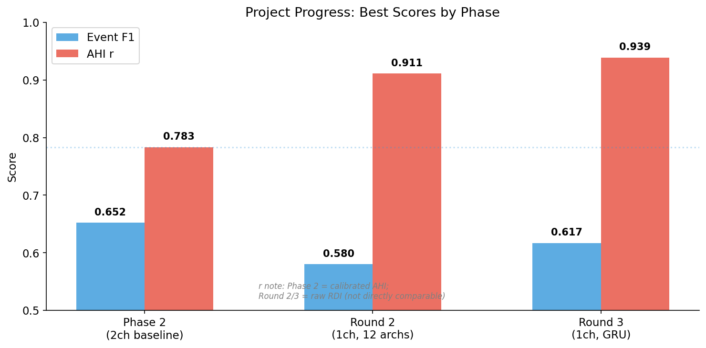
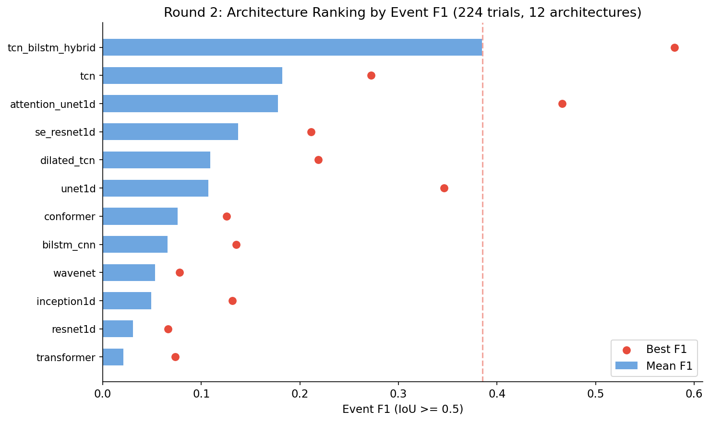
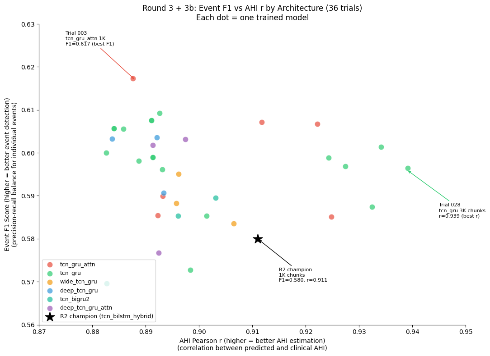
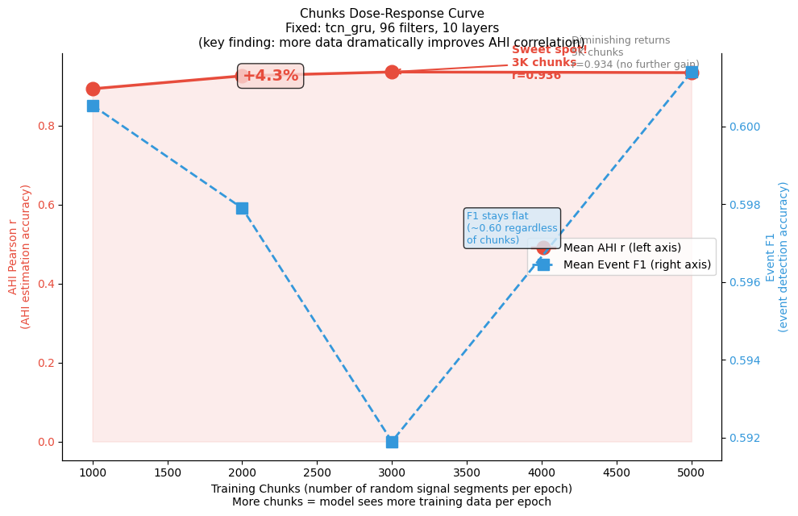
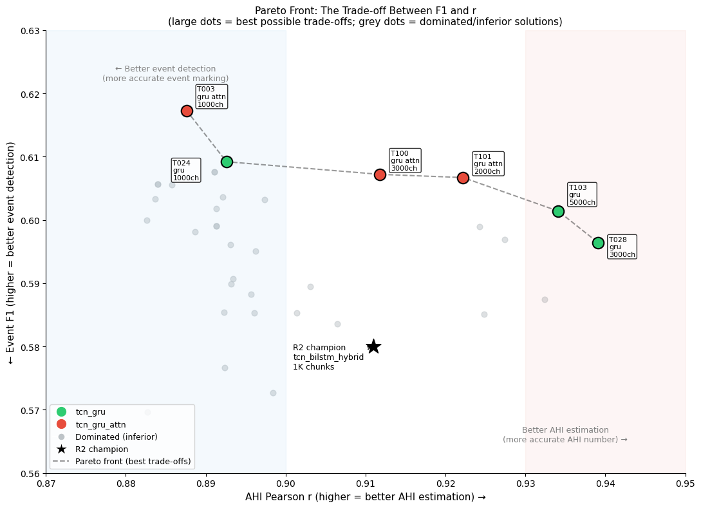
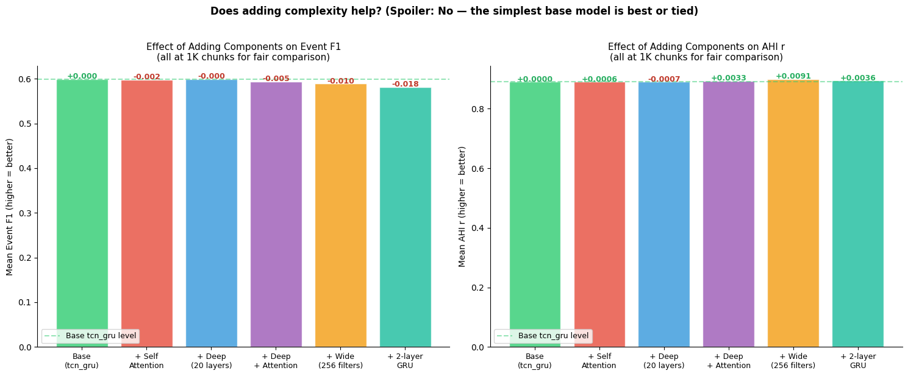
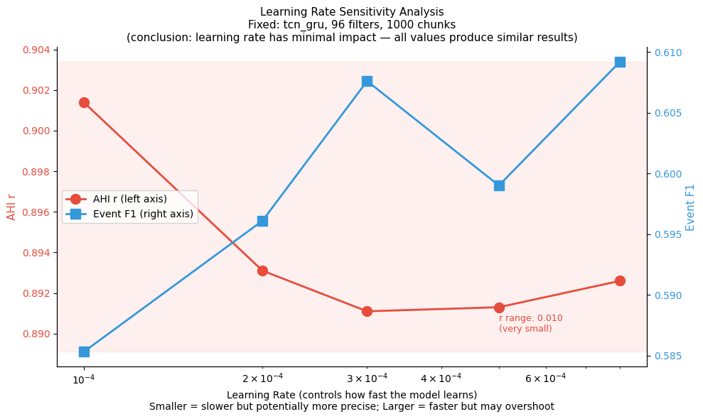

# AHI 偵測模型 — 架構搜索實驗報告

**專案**: 單通道胸帶 (THOR_RES) 呼吸事件偵測與 AHI 估計
**報告日期**: 2026-04-12
**實驗期間**: 2026-04-09 ~ 2026-04-12 (4 天)
**總運算量**: 260 trials, 50.0 GPU-hours

---

## 圖表總覽

| 圖表 | 說明 |
|------|------|
|  | 專案各階段最佳成績演進 |
|  | Round 2: 12 種架構排名 |
|  | Round 3: 各架構 F1 vs r 散佈圖 |
|  | Chunks 劑量反應曲線 (最重要發現) |
|  | Pareto Front: F1 vs r 最優解 |
|  | 架構組件效果比較 |
|  | Learning Rate 敏感度分析 |

---

## 一、實驗目標

從 12 種基礎架構 + 6 種 GRU 混合變體中，找出最適合 **單通道胸帶訊號 (THOR_RES, 10Hz)** 進行呼吸事件偵測的模型架構與訓練參數。

**評估指標**:
- **Event F1** (IoU ≥ 0.5) — 事件偵測準確度
- **AHI Pearson r** — 預測 AHI 與臨床 AHI 的相關性（臨床最重要）

---

## 二、實驗流程

```
Phase 1: 資料準備
  └── SHHS1 PSG → 單通道 THOR_RES 10Hz, 780 subjects (排除 20 壞訊號)

Phase 2: 架構大搜索 (Round 2)
  └── 12 種架構 × 多組超參 = 224 trials
  └── 精簡訓練 (30 epochs, 1000 chunks, 1-ensemble)
  └── 三台機器平行跑: Mac mini M4 + Mac Studio M2 Max + RTX 5070

Phase 3: GRU 混合架構探索 (Round 3)
  └── 6 種 TCN+GRU 混合架構 = 32 trials
  └── 基於 Round 2 冠軍 (TCN+BiLSTM) 改用 GRU 的系列變體

Phase 4: 交叉驗證實驗 (Round 3b)
  └── 驗證 chunks 數量 × attention 交互效應 = 4 trials
  └── 確認最終推薦配置
```

---

## 三、資料集

| 項目 | 內容 |
|------|------|
| 資料來源 | SHHS1 (Sleep Heart Health Study) |
| 通道 | 單通道 THOR_RES (胸帶呼吸訊號) |
| 取樣率 | 10 Hz |
| 可用 subjects | 780 (排除 20 壞訊號: 9 dead signal + 9 heavy clipping + 2 too short) |
| 訓練/驗證比 | 80/20 固定 split (seed=2026) → 624 train / 156 val |
| 事件標註 | AASM 標準: apnea + hypopnea (AHI a0h3) |
| 目標場景 | 床墊內嵌壓力感測器 → 模擬胸帶單通道 |

---

## 四、Round 2 — 架構大搜索 (224 trials)

### 4.1 測試架構

| # | 架構 | 類型 | 說明 |
|---|------|------|------|
| 1 | dilated_tcn | Conv | 擴張時間卷積網路 (基線) |
| 2 | tcn | Conv | 標準 TCN (無 gating) |
| 3 | resnet1d | Conv | 1D ResNet |
| 4 | se_resnet1d | Conv | SE-ResNet (Squeeze-Excitation) |
| 5 | inception1d | Conv | 1D Inception |
| 6 | wavenet | Conv | WaveNet 風格 |
| 7 | unet1d | Encoder-Decoder | 1D U-Net |
| 8 | attention_unet1d | Encoder-Decoder | Attention U-Net |
| 9 | bilstm_cnn | Recurrent | BiLSTM + CNN |
| 10 | transformer | Attention | Transformer encoder |
| 11 | conformer | Attention | Conformer (Conv + Attention) |
| 12 | **tcn_bilstm_hybrid** | **Hybrid** | **TCN + BiLSTM (冠軍)** |

### 4.2 結果排名

| 排名 | 架構 | Mean F1 | Best F1 | Best r | 穩定性 |
|------|------|---------|---------|--------|--------|
| **1** | **tcn_bilstm_hybrid** | **0.385** | **0.580** | **0.911** | **93%** |
| 2 | tcn | 0.182 | 0.272 | 0.851 | 90% |
| 3 | attention_unet1d | 0.178 | 0.466 | 0.830 | 67% |
| 4 | se_resnet1d | 0.137 | 0.211 | 0.805 | 100% |
| 5 | dilated_tcn | 0.109 | 0.218 | 0.905 | 76% |
| 6 | unet1d | 0.107 | 0.346 | 0.803 | 67% |
| 7 | conformer | 0.076 | 0.126 | 0.904 | 73% |
| 8 | bilstm_cnn | 0.066 | 0.136 | 0.325 | 73% |
| 9 | wavenet | 0.053 | 0.078 | 0.790 | 67% |
| 10 | inception1d | 0.049 | 0.131 | 0.793 | 50% |
| 11 | resnet1d | 0.031 | 0.066 | 0.742 | 20% |
| 12 | transformer | 0.021 | 0.073 | 0.874 | 7% |

> 穩定性 = F1 ≥ 0.05 的 trial 比例（不崩潰的比例）

### 4.3 Round 2 科學結論

| # | 問題 | 結論 |
|---|------|------|
| Q1 | Gating 有用嗎? | 有害 (tcn > dilated_tcn) |
| Q2 | Causal vs non-causal? | Non-causal 遠優於 causal |
| Q3 | Pooling vs dilation? | 平手 |
| Q4 | Dilation 必要嗎? | 絕對必要 (6x improvement) |
| Q5 | SE attention 有效嗎? | 有效 (4.5x) |
| Q6 | U-Net attention gate? | 有效 (1.7x) |
| Q7 | 並行 vs 串行多尺度? | 串行勝出 |
| Q8 | Conv vs LSTM vs Attn (pure)? | Conv 勝出 |
| Q9 | Conformer > Transformer? | 是 (3.7x) |
| **Q10** | **Hybrid > Pure?** | **壓倒性 yes (3.5x)** |


**Round 2 核心結論**: 混合架構 (Conv + Recurrent) 遠優於單一類型架構。

---

## 五、Round 3 — GRU 混合架構探索 (32 trials)

基於 Round 2 冠軍 (TCN + BiLSTM)，探索 GRU 能否取代 BiLSTM。

### 5.1 測試架構

| 架構 | 說明 | Params (nf=64) |
|------|------|----------------|
| tcn_gru | TCN → BiGRU → Linear | 586k |
| deep_tcn_gru | 20L TCN → BiGRU | 763k |
| tcn_gru_attn | TCN → BiGRU → Self-Attention | 843k |
| deep_tcn_gru_attn | 20L TCN → BiGRU → Attention | 1,346k |
| wide_tcn_gru | Wide TCN (256 filters) → BiGRU | 10,508k |
| tcn_bigru2 | TCN → 2-layer stacked BiGRU | 586k |

> Params 為 nf=64 時的參數量。nf=96 時約為 2.2 倍（如 tcn_gru nf=96 = 1,316k）。

### 5.2 結果

以下為 **1K chunks (公平對比)** 的結果：

| 架構 | Mean F1 | Best F1 | Mean r | Best r | Trials |
|------|---------|---------|--------|--------|--------|
| **tcn_gru** | **0.599** | **0.609** | 0.890 | 0.901 | 13 |
| tcn_gru_attn | 0.598 | **0.617** | 0.891 | 0.893 | 3 |
| deep_tcn_gru | 0.599 | 0.604 | 0.890 | 0.893 | 3 |
| deep_tcn_gru_attn | 0.594 | 0.603 | 0.894 | 0.897 | 3 |
| wide_tcn_gru | 0.589 | 0.595 | 0.899 | 0.906 | 3 |
| tcn_bigru2 | 0.581 | 0.590 | 0.894 | 0.903 | 3 |

> 對照: Round 2 冠軍 tcn_bilstm_hybrid (1K chunks): Best F1=0.580, Best r=0.911

**注意**: 在相同 1K chunks 條件下，tcn_gru 的 best r=0.901 略低於 tcn_bilstm_hybrid 的 0.911。GRU 的 F1 優勢明確 (0.609 vs 0.580)，但 r 的優勢需要配合更高 chunks 才顯現（見 5.3 節）。


### 5.3 Chunks 數量的決定性影響

Round 3 同時探索了訓練樣本數量 (chunks) 的效應。這是本實驗 **最重要的發現**：

```
固定 tcn_gru, nf=96, nl=10:

chunks    mean_r    best_r    Δr vs 1K
  1000    0.893     0.901     —
  2000    0.926     0.927     +0.033
  3000    0.936     0.939     +0.043    ← 甜蜜點
  5000    0.934     0.934     +0.041    ← diminishing returns
```

**增加 chunks 從 1K 到 3K，AHI r 提升 +0.043 (4.8%)**。相比之下，同一架構族內的 r 差距只有 ±0.01。


**結論**: 在已選定良好架構族（TCN+RNN hybrid）的前提下，訓練資料量對 r 的提升效果遠大於架構微調。

---

## 六、Round 3b — 交叉驗證 (4 trials)

驗證 Attention + High Chunks 能否同時達到 F1 和 r 最佳：

| Trial | 架構 | Chunks | F1 | r |
|-------|------|--------|-----|---|
| 100 | tcn_gru_attn | 3000 | 0.607 | 0.912 |
| 101 | tcn_gru_attn | 2000 | 0.607 | 0.922 |
| 102 | tcn_gru_attn (nf=96) | 3000 | 0.585 | 0.925 |
| 103 | tcn_gru (nf=96) | 5000 | 0.601 | 0.934 |

**結論**: F1 和 r 無法同時最大化。Attention 有利 F1 但壓低 r。


---

## 七、全局對比 — 專案進展

| 階段 | 最佳架構 | Event F1 | AHI r | r 計算方式 | 說明 |
|------|----------|----------|-------|-----------|------|
| 先期研究 (2ch) | AttentionSegNet | 0.652 | 0.783 | calibrated AHI vs AHI | ABDO + THOR 雙通道 |
| Round 2 (1ch) | tcn_bilstm_hybrid | 0.580 | 0.911 | raw RDI vs AHI | 單通道, 1K chunks |
| **Round 3 (1ch)** | **tcn_gru** | **0.609** | **0.939** | raw RDI vs AHI | **單通道, 3K chunks** |


> **重要**: 先期研究的 r=0.783 使用校正後 AHI，Round 2/3 的 r 使用未校正 raw RDI，兩者**不可直接比較**。Raw RDI r 通常高於 calibrated AHI r。Event F1 可直接比較。
>
> Round 3 的 r 提升 (0.911→0.939) 主要來自 chunks 數量增加 (1K→3K)，而非架構改變。在相同 1K chunks 下，tcn_gru best r=0.901 略低於 tcn_bilstm_hybrid 的 0.911。

---

## 八、關鍵科學發現摘要


### 8.1 架構層面
1. **混合架構 (Conv + Recurrent) 大幅優於純架構** — 效果差 3-10 倍
2. **GRU 可替代 BiLSTM** — 更小 (-12% params, 586k vs 668k)、更穩 (100% vs 93%)、F1 更好 (+5%)。但在同等 1K chunks 下 r 略低 (0.901 vs 0.911)，需要更多 chunks 才能超越
3. **Depth/Width 增加無效** — 10 層 TCN + 單層 BiGRU 已是最佳深度
4. **Self-Attention 有微弱 F1 增益但犧牲 r** — 不建議常規使用

### 8.2 訓練層面
5. **訓練 chunks 數量是 AHI r 的最大推手** — 在同一架構族內，chunks 效應 (+0.043) 遠大於超參微調 (±0.01)
6. **3000 chunks 是甜蜜點** — 超過後 diminishing returns
7. **Learning rate 不敏感** — 0.0003~0.0008 都好 (見下圖)


8. **零病態 overfit** — Round 3/3b 所有 36 trials 的 train-val gap < 0.10

### 8.3 工程層面
9. **MPS (Apple Silicon) 跑 GRU 極慢** — 比 CUDA 慢 100 倍，GRU 實驗需用 NVIDIA GPU
10. **Reproducibility 完美** — 3 組重複 config (trials 018/030, 023/029, 022/031) 結果完全一致 (diff=0.0000)

---

## 九、最終推薦配置

```
架構:       tcn_gru (TCN → BiGRU → Linear)
通道:       單通道 THOR_RES, 10 Hz
n_filters:  96
n_layers:   10
kernel_size: 7
dropout:    0.15
lr:         0.0005
loss:       BCE (pos_weight=1.5)
chunks:     3000
參數量:     1,315,969 (1.32M)
```

**精簡訓練性能 (30ep, 1-ensemble)**: Event F1 ≈ 0.60, AHI r (raw RDI) ≈ 0.94

---

## 十、下一步計畫

| 步驟 | 內容 | 預估時間 |
|------|------|----------|
| **A. Full Training** | 60 epochs, 3K chunks, 3-ensemble | ~6 hr |
| **B. 5-fold CV** | 5 folds × 3 seeds = 15 runs | ~12 hr |
| **C. AHI 校正** | Linear calibration RDI → AHI | 1 hr |
| **D. 輔大醫院驗證** | 本地 PSG cross-domain test | TBD |

---

## 十一、運算環境

| 機器 | 硬體 | 角色 | 時間 |
|------|------|------|------|
| Mac mini M4 | Apple M4, 16GB | 輕量 trial + 報告 | ~13 hr |
| Mac Studio M2 Max | Apple M2 Max, 32GB | 中型 trial | ~14 hr |
| Windows Desktop | NVIDIA RTX 5070 | 主力 GPU 訓練 | ~23 hr |
| **總計** | | | **~50 hr** |

---

## 十二、檔案結構

```
ahi-detection-v2/
├── integrated_ahi/
│   ├── arch_zoo.py                    # 18 種架構定義
│   ├── trial_runner.py                # 單 trial 執行器
│   ├── sweep_trials/                  # Round 2 (224 trials)
│   │   ├── results/                   # 224 result JSONs
│   │   ├── heatmaps/                  # loss + event heatmaps
│   │   ├── BOSS_REPORT.md             # Round 2 報告 (繁中)
│   │   └── SWEEP_REPORT.md            # Round 2 報告 (英文)
│   ├── sweep_round3/                  # Round 3 (32 trials)
│   │   ├── results/                   # 32 result JSONs
│   │   ├── heatmaps/                  # 64 PNGs
│   │   ├── ROUND3_REPORT.md           # Round 3 報告
│   │   └── DEEP_ANALYSIS.md           # 深度分析
│   ├── sweep_round3b/                 # Round 3b (4 trials)
│   │   └── results/                   # 4 result JSONs
│   └── dataset_audit/                 # 資料品質審核
│       └── excluded_nsrrids.txt       # 20 excluded subjects
├── thor_only_data/                    # 單通道 THOR 資料
│   ├── shhs1/ (5793 subjects)
│   └── shhs2/ (2651 subjects)
└── ARCHITECTURE_SWEEP_REPORT.md       # 本報告
```
